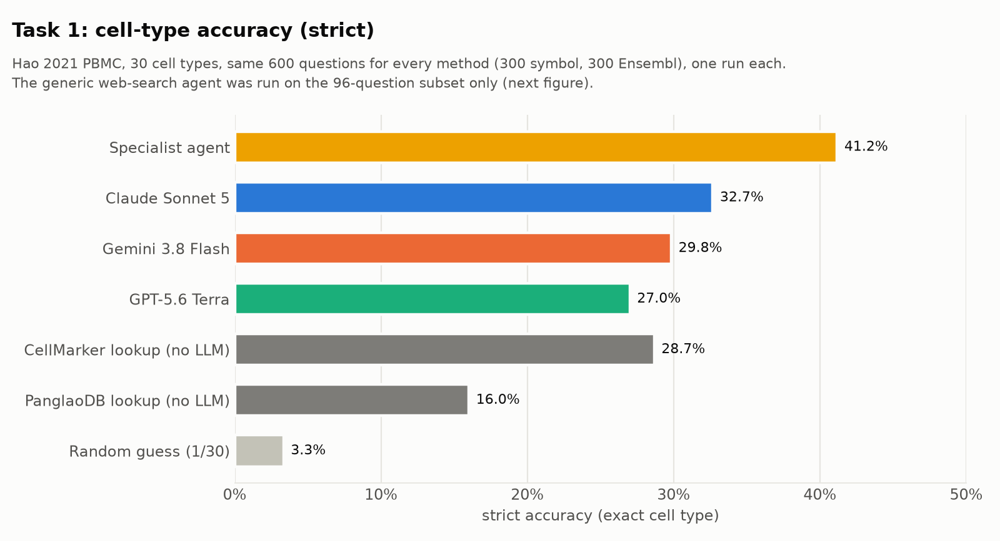
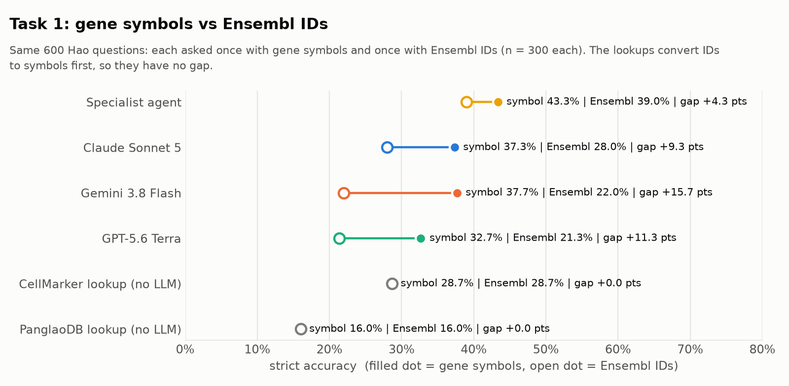
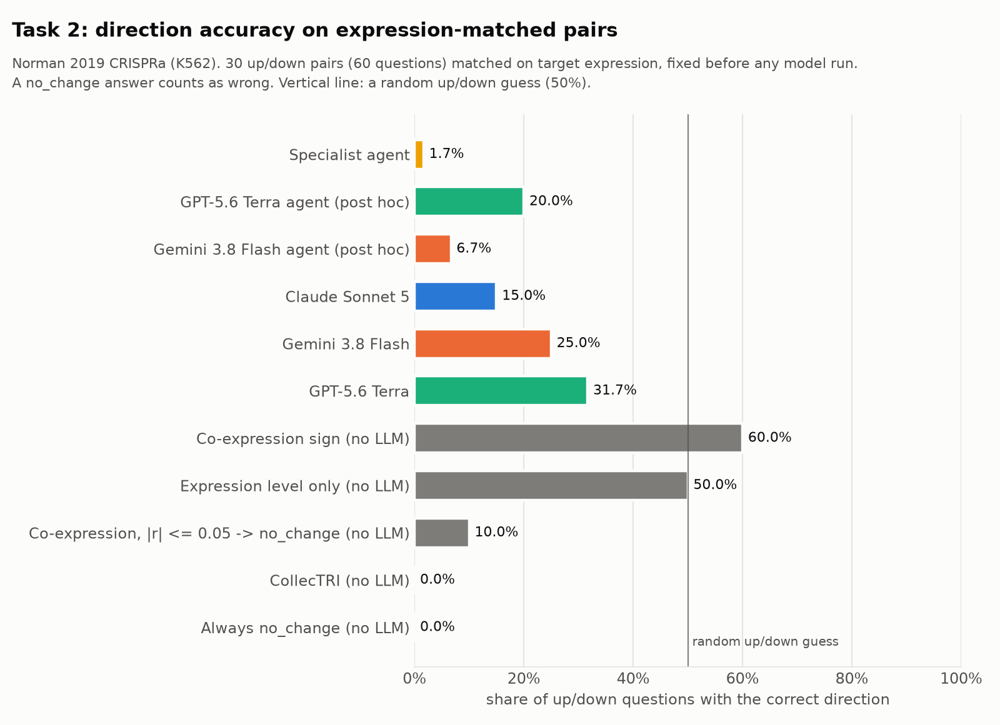
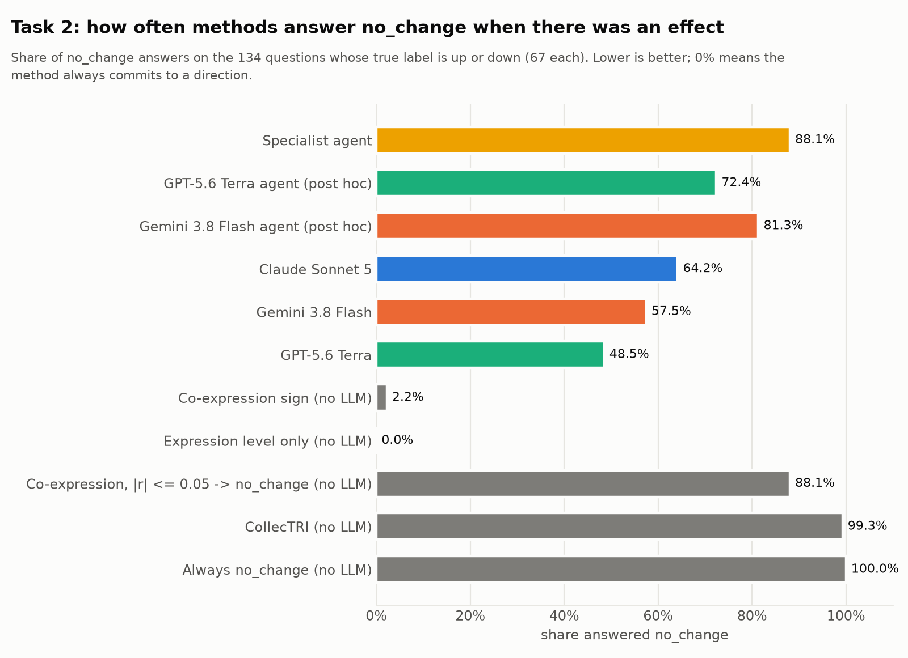
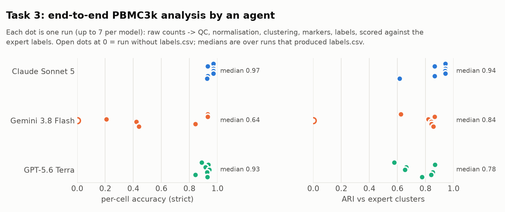
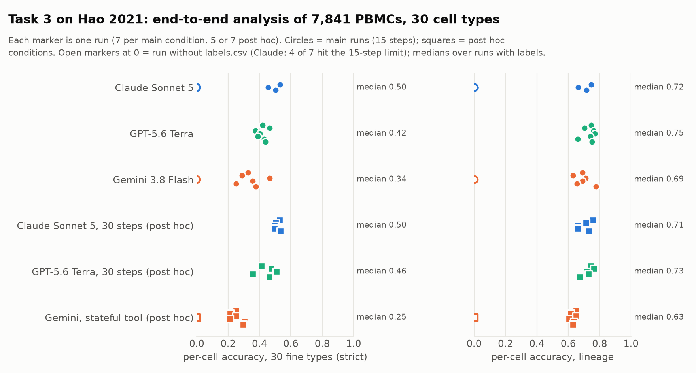

# llm-bio-bench

A small benchmark of how well large language models answer two everyday single-cell biology questions,
with and without tools, compared against simple non-LLM baselines. **Task 1** asks a model to name the
cell type behind a list of marker genes (30 fine-grained PBMC types from Hao et al. 2021, given as gene
symbols or Ensembl IDs, under several difficulty settings). **Task 2** asks whether switching one gene
on with CRISPR activation makes another gene go up, down or not change (Norman et al. 2019, K562
cells). Claude Sonnet 5, GPT-5.6 Terra and Gemini 3.8 Flash are compared with marker-database lookups,
co-expression and TF-network baselines, and with Claude run as a tool-using agent. All numbers below are
taken from [`methods.md`](methods.md), which documents every scoring and design choice.

## The question

Do general-purpose LLMs carry usable single-cell biology knowledge, where do they fail, and does giving
them domain tools (gene lookups, marker databases, co-expression data) help or hurt?

## Datasets

| Dataset | Use | Source |
|---|---|---|
| PBMC3k (10x Genomics, via `scanpy.datasets.pbmc3k()`) | Task 1 pilot: 8 Leiden clusters | scanpy tutorial |
| Hao et al. 2021 CITE-seq PBMC reference | Task 1: 30 expert-labelled cell types (`celltype.l2`), up to 500 cells per type | CELLxGENE, `nygc multimodal pbmc` (161,764 cells) |
| Norman et al. 2019 CRISPRa Perturb-seq | Task 2: 105 single-gene activations in K562 + 11,855 control cells | scPerturb, Zenodo DOI 10.5281/zenodo.7041849 |
| CellMarker (Hao 2021 rows excluded) and PanglaoDB | Task 1 lookup baselines and agent tools | CellMarker (downloaded by hand 2026-09-24); panglaodb.se |
| CollecTRI | Task 2 TF-target baseline and agent tool | decoupler 2.2.0 / OmniPath, snapshot 2026-09-27 |

## Tasks

- **Task 1 - cell-type annotation.** "These are the top marker genes of a cluster from human PBMCs. What
  cell type is it?" Each question comes in two gene formats (symbols / Ensembl IDs) and four difficulty
  knobs: less famous genes (marker ranks 1-10 ... 31-40), fewer genes (1, 3, 5, 10), noise (random genes
  swapped in) and a ribosomal/mitochondrial gene filter. Free-text answers are mapped to the 30 labels by
  exact matching plus a blinded LLM judge. The main comparison uses the 600 non-noise Hao questions.
- **Task 2 - perturbation direction.** "In K562 cells, gene X is activated with CRISPRa. What happens to
  the expression of gene Y? Answer up, down, or no_change." 200 questions (67 up, 67 down, 66
  no_change) built from pseudobulk differential expression, with no_change targets matched on
  expression level; 30 expression-matched up/down pairs isolate direction from expression level.

- **Task 3 - end-to-end analysis.** An agent gets a sandboxed folder with only the raw PBMC3k counts and a
  `run_python` tool (no network, no access outside the folder, 60 s per execution, at most 15 executions,
  $1.50 per run) and must do QC, normalisation, clustering, marker finding and labelling itself, saving
  labels.csv. Scored per cell against the tutorial-pipeline labels (8 types) and by ARI; 7 runs per model.

## Conditions

| Condition | Task 1 | Task 2 |
|---|---|---|
| Plain LLMs: Claude Sonnet 5 (Anthropic API), GPT-5.6 Terra and Gemini 3.8 Flash (OpenRouter) | yes | yes |
| Random guess | yes | - |
| Marker lookup, no LLM (CellMarker, PanglaoDB) | yes | - |
| Co-expression sign in control cells, expression level only, CollecTRI, always no_change (no LLM) | - | yes |
| Generic agent: Claude + web search (LangGraph ReAct, <= 5 tool calls) | 96-question subset | - |
| Specialist agent: Claude + MyGene.info + CellMarker lookup | 96 subset and all 600 | - |
| Specialist + nudge (one-line system prompt, **added post hoc** after error analysis) | 96 subset | - |
| Specialist agent: Claude + MyGene.info + control-cell co-expression + CollecTRI | - | yes |
| Specialist agent with GPT-5.6 Terra / Gemini 3.8 Flash (same tools and prompt) | 96 subset | yes (**post hoc**) |

## Headline results

### Task 1 (Hao 2021, 30 cell types, same 600 questions per method, one run each; strict = exact type)

| Method | Strict | Strict, symbols | Strict, Ensembl |
|---|---|---|---|
| Specialist agent (Claude + tools) | 41.2% | 43.3% | 39.0% |
| Claude Sonnet 5 | 32.7% | 37.3% | 28.0% |
| Gemini 3.8 Flash | 29.8% | 37.7% | 22.0% |
| GPT-5.6 Terra | 27.0% | 32.7% | 21.3% |
| CellMarker lookup (no LLM, tie-break) | 28.7% | 28.7% | 28.7% |
| PanglaoDB lookup (no LLM, tie-break) | 16.0% | 16.0% | 16.0% |
| Random guess | 3.3% | 3.3% | 3.3% |

Specialist vs plain Claude, paired: right where Claude was wrong on 58 questions, the reverse on 7
(sign test p = 4.3e-11). A second, independent judge pass over 1,140 of the 1,290 judge decisions agreed on
90.9% of labels (97.4% on lineage) and moved these scores by at most 1.5 points without changing the ranking.
On the 96-question subset: generic web agent 31.2%, plain Claude 30.2%,
specialist 38.5%, specialist + nudge 42.7% (post hoc). The same specialist agent with GPT reached 43.8%
(plain GPT 29.2%; 15 vs 1 discordant questions, p = 0.0005) and with Gemini 38.5% (plain Gemini 30.2%;
11 vs 3, p = 0.057); neither differed significantly from Claude's agent (GPT 8 vs 3, p = 0.227).

**PBMC3k pilot** (8 broad cell types, 320 questions x 3 runs, keyword scoring): Claude Sonnet 5 78.6%,
Gemini 3.8 Flash 72.6%, GPT-5.6 Terra 70.5%, CellMarker lookup 64.4%, random 12.5% strict; the same
Ensembl drop appears (Gemini 82.1% with symbols vs 63.1% with Ensembl IDs).




### Task 2 (Norman 2019 CRISPRa, 200 questions, one run each)

| Method | Accuracy | Macro-F1 | Direction, all up/down | Direction, matched pairs | no_change on up/down |
|---|---|---|---|---|---|
| GPT-5.6 Terra | 46.0% | 0.430 | 29.9% | 31.7% | 49% |
| Gemini 3.8 Flash | 45.5% | 0.410 | 26.1% | 25.0% | 57% |
| Claude Sonnet 5 | 41.5% | 0.359 | 20.9% | 15.0% | 64% |
| Specialist agent (Claude + 3 tools) | 39.0% | 0.288 | 9.7% | 1.7% | 88% |
| Expression level only (no LLM) | 49.0% | 0.391 | 73.1% | 50.0% | 0% |
| Co-expression sign (no LLM) | 42.0% | 0.345 | 61.9% | 60.0% | 2% |
| CollecTRI (no LLM) | 33.5% | 0.176 | 0.7% | 0.0% | 99% |
| Always no_change | 33.0% | 0.165 | 0.0% | 0.0% | 100% |
| *Post hoc:* specialist agent (GPT + 3 tools) | 43.5% | 0.370 | 18.7% | 20.0% | 72% |
| *Post hoc:* specialist agent (Gemini + 3 tools) | 39.5% | 0.312 | 11.9% | 6.7% | 81% |

Post hoc condition A (added after the Claude agent results): with the same tools, GPT and Gemini also
lost direction accuracy against their plain answers (6 vs 21, p = 0.006; 2 vs 21, p = 6.6e-05) and also
read weak co-expression (|r| <= 0.05) as no_change (85% and 89% of the time; Claude's agent 94%).




### Task 3 (raw PBMC3k counts -> labels, 7 runs per model, all via OpenRouter)

| Model | Runs with labels | Strict mean (SD) | ARI mean | Steps mean | Cost per run (est.) |
|---|---|---|---|---|---|
| Claude Sonnet 5 | 7/7 | 95.3% (2.3%) | 0.87 | 12.1 | $0.191 |
| GPT-5.6 Terra | 7/7 | 91.1% (3.5%) | 0.75 | 9.7 | $0.148 |
| Gemini 3.8 Flash | 6/7 | 53.9% (37.0%) | 0.81 | 15.0 | $0.077 |

The most common error was in clustering: CD8 T cells partly merged into a CD4-majority cluster (10 of
21 runs) or merged with NK cells into one cluster named NK (5 runs). Gemini used all 15 steps in every run,
largely re-running the pipeline after assuming variables persisted between calls.



### Task 3 on Hao 2021 (raw counts of 7,841 cells, 30 fine types, 7 runs per model, same setup)

| Model | Runs with labels | Strict, runs with labels (range) | Coarse (lineage) | ARI | Cost per run (est.) |
|---|---|---|---|---|---|
| Claude Sonnet 5 | 3/7 | 49.7% (45.6-53.1%) | 70.9% | 0.54 | $0.390 |
| GPT-5.6 Terra | 7/7 | 41.7% (37.5-46.6%) | 73.4% | 0.53 | $0.180 |
| Gemini 3.8 Flash | 6/7 | 34.5% (25.2-46.5%) | 69.3% | 0.47 | $0.090 |

Claude hit the 15-step limit without saving labels in 4 of 7 runs. The main error for every model was
T-cell subtypes: 55% (Claude), 60% (GPT) and 62% (Gemini) of CD8 T cells got CD4-lineage labels. No run reused the PBMC3k tutorial QC
thresholds (on PBMC3k, Claude and Gemini kept exactly the tutorial's 2,638 cells).

Post hoc, each a separate condition (see methods.md):
- **B, 30-step cap (Claude, GPT, 5 runs each):** Claude finished all 5 runs (mean 22 steps, $0.734 per
  run) at 51.1% strict; GPT 44.3%, still 8-11 steps. Extra steps turned Claude's step-limit failures into
  finished runs without better accuracy; the T-cell confusions stayed, so they are decision errors.
- **C, stateful Python tool for Gemini (7 runs per dataset):** code errors fell (PBMC3k 26 -> 6, Hao
  18 -> 0). PBMC3k mean strict rose from 53.9% to 72.5%; Hao fell from 29.5% to 21.8%.



## Key findings - DRAFT (to be rewritten)

1. **Domain tools help cell-type annotation.** The specialist agent reached 41.2% strict accuracy on the
   600 Hao questions vs 32.7% for plain Claude and 28.7% for the CellMarker lookup it uses as a tool.
2. **Ensembl IDs cost the plain LLMs 9.3-15.7 points; the tools remove most of that gap.** Plain models
   drop from symbols to Ensembl IDs (Gemini 37.7% -> 22.0%); the specialist drops only 4.3 points
   (43.3% -> 39.0%), and with Ensembl IDs a plain lookup (28.7%) is on par with plain Claude (28.0%).
3. **Fine subtypes stay unsolved.** CD4 T subtypes reach only 2-7% strict for plain Claude, the lookup
   and the specialist alike.
4. **On perturbation direction, no LLM beats a simple baseline.** On expression-matched up/down pairs
   the LLMs score 15.0-31.7% (they often answer no_change), while the sign of control-cell co-expression
   scores 60.0%.
5. **Tools can hurt when read the wrong way.** The Task 2 agent answered no_change on 88% of up/down
   questions and did worse than plain Claude on direction (4 vs 19 discordant questions, p = 0.003); in
   105 of its 122 wrong answers it read a weak control-cell correlation (|r| <= 0.05) as "no effect".

## Limitations

- **One run per question** for Task 1 on Hao and for Task 2 (the PBMC3k pilot used 3 runs, and accuracy
  moved by at most 1.2 points between runs); n is small for some comparisons (96-question subset, 60
  matched-pair questions).
- **The LLM judge is a Claude model scoring Claude and other models.** It is blind to the model and the
  true label, agreed with a 30-answer hand-check on 27/30 before its rules were tightened, scores 96% on
  a 34-case test set, and is not fully deterministic (re-judging changed 3.8% of labels, 0.3 points of
  strict accuracy).
- **Possible training-data contamination:** Hao 2021 and Norman 2019 are public and may be in the models'
  training data. Hao-derived rows were removed from CellMarker; nothing can be removed from the models.
- **Task 2 labels depend on analysis choices:** the fold change is a difference of mean log-expression
  (understates changes in lowly expressed genes), Welch's t-test with BH per activated gene, and fixed
  label thresholds. Up targets are less expressed than down targets (detection alone separates them with
  AUC 0.80), which is why direction is also reported on expression-matched pairs.
- **One model per provider, one prompt, one cell line (K562).** GPT and Gemini were called through
  OpenRouter. Agents got no instructions on how to use tools (same prompt as plain models); the nudge is
  a post hoc exception. The generic web agent was only run on the 96-question subset.
- The judge's handling of "X/Y" alternatives is not yet fully consistent (a re-judging pass was
  interrupted when API credit ran out; see `methods.md`, open decisions).

## Future work

- **Gene pairs:** Norman 2019 has 131 two-gene activations whose genes are all also activated alone -
  predict the combination from the singles, or detect genetic interactions.
- **Task 3 on less famous data:** PBMC3k is the scanpy/Seurat tutorial dataset and its labels come from
  the tutorial pipeline, so models may have memorised both (Claude and Gemini reproduced the tutorial QC
  thresholds exactly). Repeat Task 3 on a dataset without a well-known tutorial.
- Agents that are told what tool outputs mean (e.g. that weak co-expression is not evidence of no
  effect), repeat runs, and more models per provider.

## How to reproduce

Python 3.14, packages in `requirements.txt`. API keys go in `.env` (git-ignored): `ANTHROPIC_API_KEY`,
`OPENROUTER_API_KEY` (and optionally `GEMINI_API_KEY` for the direct Google API). Run from the repo root:

```bash
python3 -m venv venv && source venv/bin/activate && pip install -r requirements.txt
```

**Task 1**

```bash
python src/prepare_data.py && python src/make_questions.py pbmc      # PBMC3k pilot (downloads itself)
# Hao 2021: save https://datasets.cellxgene.cziscience.com/4078abd1-063d-4b35-aa04-324dddf8244e.h5ad
#           as data/hao2021_pbmc.h5ad (2.6 GB, git-ignored)
python src/prepare_hao.py && python src/make_questions.py hao
python src/run_eval.py anthropic/claude-sonnet-5 --dataset hao --skip-knob noise
python src/run_eval.py openai/gpt-5.6-terra --dataset hao --skip-knob noise
python src/run_eval.py google/gemini-3.8-flash --provider openrouter --dataset hao --skip-knob noise
# marker databases into data/markers/: PanglaoDB_markers_27_Mar_2020.tsv.gz and human_cell_marker.txt
python src/baseline_marker_lookup.py hao cellmarker && python src/baseline_marker_lookup.py hao panglaodb
python src/agent_subset.py
python src/run_agent.py generic && python src/run_agent.py specialist && python src/run_agent.py specialist_nudge
python src/run_agent.py specialist --questions all_nonoise
python src/judge.py && python src/score.py hao --skip-knob noise && python src/compare_baselines.py
python src/score_agents.py && python src/score_agents.py --all-nonoise
```

**Task 2**

```bash
# Norman 2019: NormanWeissman2019_filtered.h5ad from Zenodo record 7041849 into data/norman2019/ (699 MB)
python src/inspect_norman.py && python src/task2_build.py && python src/task2_baselines.py
python src/run_eval.py anthropic/claude-sonnet-5 --dataset task2
python src/run_eval.py openai/gpt-5.6-terra --dataset task2
python src/run_eval.py google/gemini-3.8-flash --provider openrouter --dataset task2
python src/run_agent_task2.py
python src/task2_score.py && python src/task2_agent_analysis.py
```

**Task 3** (macOS: uses `sandbox-exec`; needs `OPENROUTER_API_KEY`)

```bash
python src/prepare_data.py                       # also writes the per-cell answer key data/pbmc3k_expert_cells.csv
python src/task3_agent.py --runs 7               # 7 runs per model; stops if the OpenRouter balance is below $3
python src/task3_score.py
python src/task3_hao_data.py                     # Hao input (data/task3_hao_raw_counts.h5ad) and answer key
python src/task3_agent.py --runs 7 --dataset hao && python src/task3_hao_score.py
# post hoc: --max-steps 30 (B), --stateful --models gemini (C); score with --dir results/task3_hao_30steps etc.
```

**Figures:** `python src/make_figures.py` writes `results/figures/`.

All runs are resumable (answers are saved as they come in) and `--test` flags ask one question without
saving. Seeds are fixed for every sampling step.

## Cost

API spend logged per answer in the results files (US$):

| Component | Cost |
|---|---|
| Task 1, PBMC3k pilot (3 models x 3 runs) | $10.74 |
| Task 1, Hao, plain models | $8.65 |
| Task 1, agents (generic, specialist incl. all 600, nudge) | $9.19 |
| Task 2, plain models | $1.80 |
| Task 2, specialist agent | $1.55 |
| Task 3, 21 agent runs (estimated at list prices) | $2.91 |
| Task 1, plain GPT and Gemini on the missing noise questions (for the 96-question comparison) | $0.24 |
| Task 1, specialist agent with GPT ($0.52) and Gemini ($0.47), 96 questions | $0.99 |
| Task 3 on Hao, 21 runs (estimated at list prices) | $4.63 |
| Post hoc A: Task 2 specialist agent with GPT ($1.09) and Gemini ($1.10) | $2.19 |
| Post hoc B: Task 3 Hao, 30-step cap, 10 runs | $4.52 |
| Post hoc C: stateful Gemini, PBMC3k ($0.38) and Hao ($0.51) | $0.89 |
| **Total logged** | **$48.31** |
| Judge check (second pass, 1,140 decisions; from the OpenRouter balance, not logged per call) | $5.63 |

Not included: LLM-judge calls, one-question tests, and runs discarded before cost logging was added.

**Account totals (actual spend): [PLACEHOLDER - to be filled in from the Anthropic and OpenRouter accounts]**
